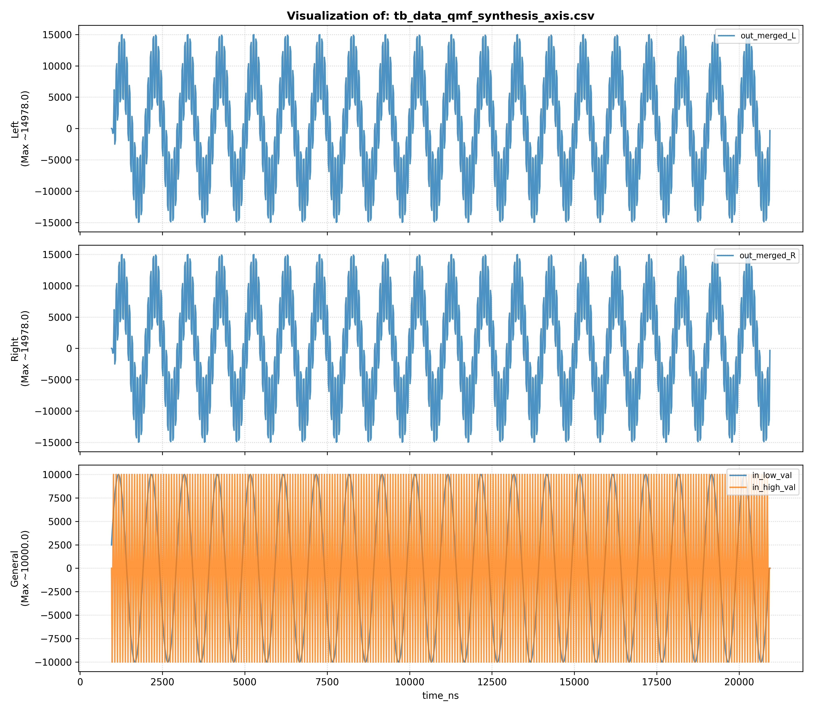
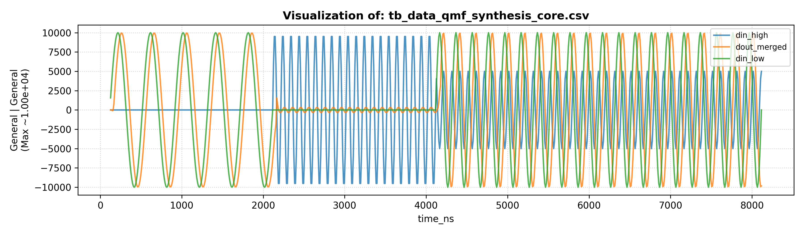

# QMF Testbench Results

This directory contains **simulation results (CSV + plots)** generated by the
Quadrature Mirror Filter (QMF) testbench suite in this repository.

Each result consists of:
- **CSV files** → raw numerical data produced by the testbench
- **PNG plots** → waveform visualizations for manual inspection

> All plots are intended for **visual sanity checking only**, not for automated
> metric evaluation.

---

## 1. QMF Analysis — AXI Wrapper

**Files:**
- `tb_data_qmf_analysis_axis.csv`
- `tb_data_qmf_analysis_axis.png`

**Plotted signals:**
- Stereo input audio
- Low subband output (L/R)
- High subband output (L/R)

---

## 2. QMF Analysis — Core (Non-AXI)

**Files:**
- `tb_data_qmf_analysis_core.csv`
- `tb_data_qmf_analysis_core.png`

**Plotted signals:**
- Input sample
- Low-band output
- High-band output

---

## 3. QMF Synthesis — AXI Wrapper

**Files:**
- `tb_data_qmf_synthesis_axis.csv`
- `tb_data_qmf_synthesis_axis.png`

**Plotted signals:**
- Low-band input
- High-band input
- Reconstructed stereo output (L/R)

---

## 4. QMF Synthesis — Core (Non-AXI)

**Files:**
- `tb_data_qmf_synthesis_core.csv`
- `tb_data_qmf_synthesis_core.png`

**Plotted signals:**
- Original input
- Low subband
- High subband
- Reconstructed output

---

## 5. QMF System — AXI (End-to-End)

**Files:**
- `tb_data_qmf_system_axis.csv`
- `tb_data_qmf_system_axis.png`

**Plotted signals:**
- Input audio
- Low-band signal
- High-band signal
- Reconstructed output

---

## 6. QMF System — Core (End-to-End, Non-AXI)

**Files:**
- `tb_data_qmf_system_core.csv`
- `tb_data_qmf_system_core.png`

**Plotted signals:**
- Original input
- Low subband output
- High subband output
- Final reconstructed signal

---

## Notes on Interpretation

- CSV logs are **not cycle-aligned** with outputs due to pipeline latency.
- The plots are intended for:
  - Subband separation verification
  - Reconstruction behavior inspection
  - Fixed-point DSP sanity checking
- They are **not intended** for:
  - THD / SNR measurements
  - Automated regression testing
  - Performance benchmarking

---

## Status

✔ All testbenches execute consistently  
✔ Observed behavior matches expectations for a Johnston 8A QMF prototype  
✔ Results are considered **final and stable**

The scope of this directory is intentionally fixed to preserve clarity and
consistency across this QMF repository and related DSP building blocks.
